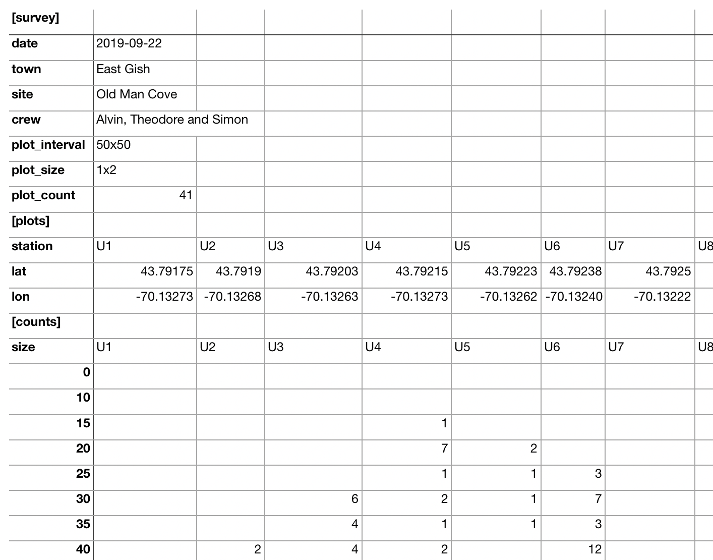
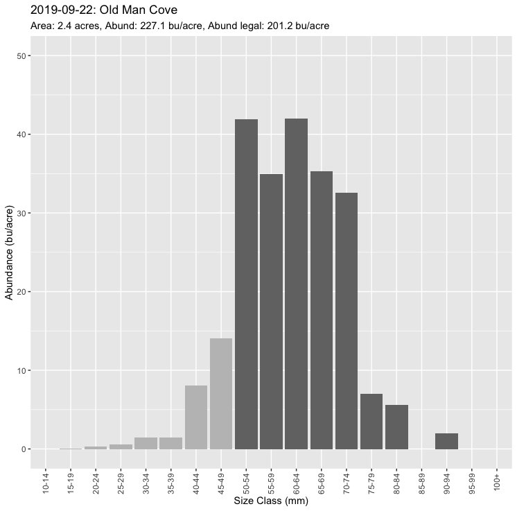
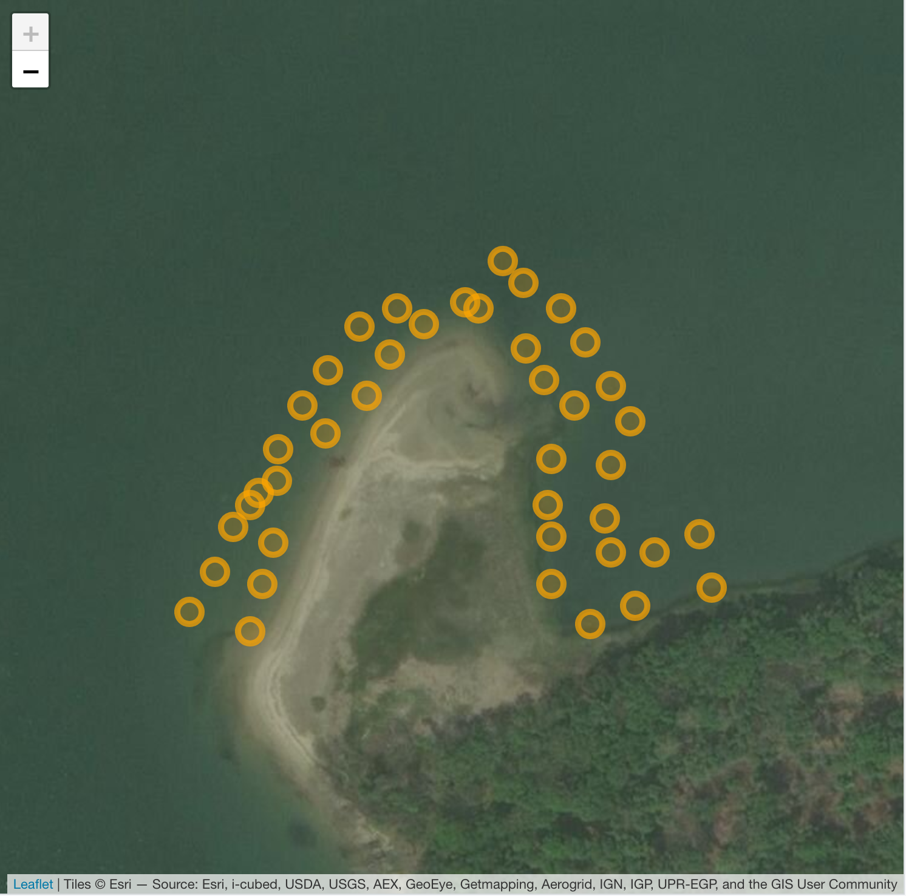

# softshell

An [R](https://www.r-project.org/) software package for importing, managing and viewing softshell survey data.  

## Installation

Use the [devtools package](https://CRAN.R-project.org/package=devtools) to install directly from [github](https://github.com/btupper/softshell).  Other R packages needed for installation will be installed automtically.

```
devtools::install_github("btupper/softshell")
```

## Data

Surveys are conducted as described [here](https://www.maine.gov/dmr/shellfish-sanitation-management/programs/municipal/forms/index.html).  Sample [sheets](https://www.maine.gov/dmr/shellfish-sanitation-management/programs/municipal/forms/documents/samplesurveydatasheet.pdf) are used to keep a tally of the clam counts by size class. Generally the completed data sheets are retained by DMR's area biologist to produce a [summary report](https://www.maine.gov/dmr/shellfish-sanitation-management/programs/municipal/forms/documents/ClamFlatSurveyDatasheetnew2012.xls).  

This package encourages municipalties to digitize the raw survey results by copying counts and locations into a simple spreadsheet form *before* sending the records to the area biologist. A well maintined set of survey records can enhance decision making down the road.  A blank template and a complete example may be exported using the package as shown below.

## Usage

### Examine an example spreadsheet

And example complete spreadsheet may be exported using the `export_template(filename)` function.

```
library("softshell")
export_template(filename = "the_template.xls")
```
The template shows the three required sections: `[survey]`, `[plots]` and `[counts]`.  The `[survey]` section contains basic essential info about the survey, the crew, the spacing used and the number of plots.  The `[plots]` section contains the GPS location of each sample plot - hopefully recorded as decimal degrees with 5 digits of precision.  The `[counts]` records the tally of clams found at each sample plot lcoation.  Note that the 0-10mm category (aka spat) is currently ignored by the package, but will be used in the future.  

Note the required parts in the spreadsheet are in black faced font while the examples, which you can overwrite, are in grey faced font.

A complete example can also be exported. 

```
export_example(filename = "the_example.xls")
```

 Here is a peek at the contents of the example.
 



### Import an Excel Report

Once you have completed the survey and transfered the metadata, plot locations and counts to the template, you can save it as either a `.xls` or `.xlsx` Excel spreadsheet file. Any spreadsheet will work, such as Google Sheets, Apple Numbers, etc. as long as it permits export to Microsoft Excel format.Barring unexpected issues, you can easily import this into R using the `import_report_xls(filename)` function.  For this example, we can use the exported example from above.  We show how to read the file and then print it (by typing its variable name.)  Printing shows a very simply summary of the survey object.

```
survey <- import_report_xls("the_example.xls")
survey
# Softshell Survey data: 2019-09-22, East Gish, Old Man Cove 
# N plots: 41, Area: 2.4 acres 
# Abundance: 227.1 bushels per acre 
# Legally sized abundance, 201.2 bushels per acre 
```

### Plot an abundance report

We can easily plot the survey results (without spats) as an abundance histogram (bushel per acre for each size class).

```
plot(survey)
```




### Map plot locations

We can also draw a map of the plot locations.

```
draw_map(survey)
```




